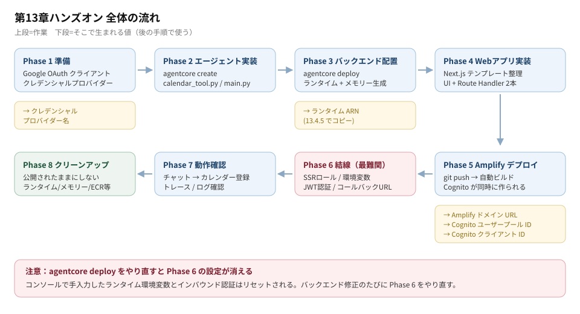
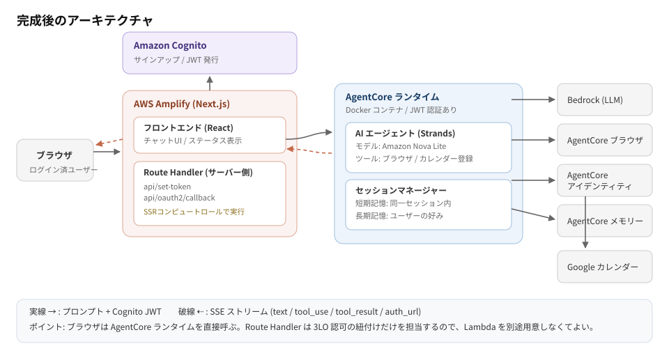
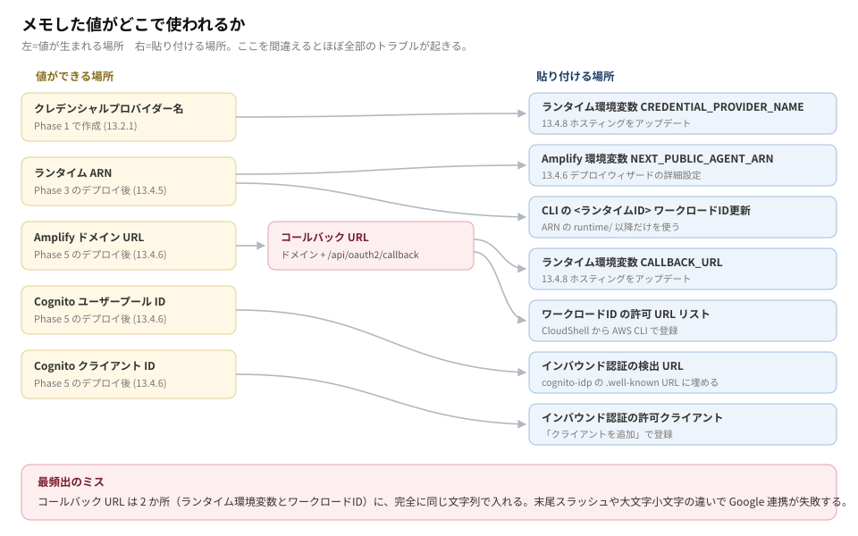
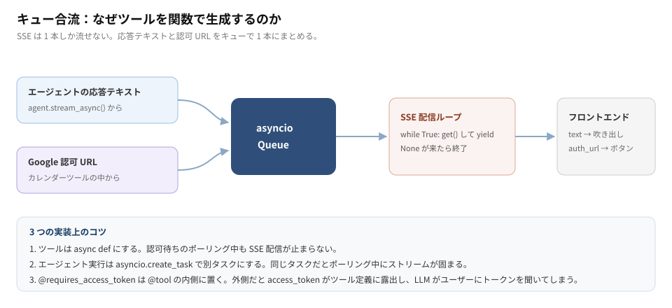
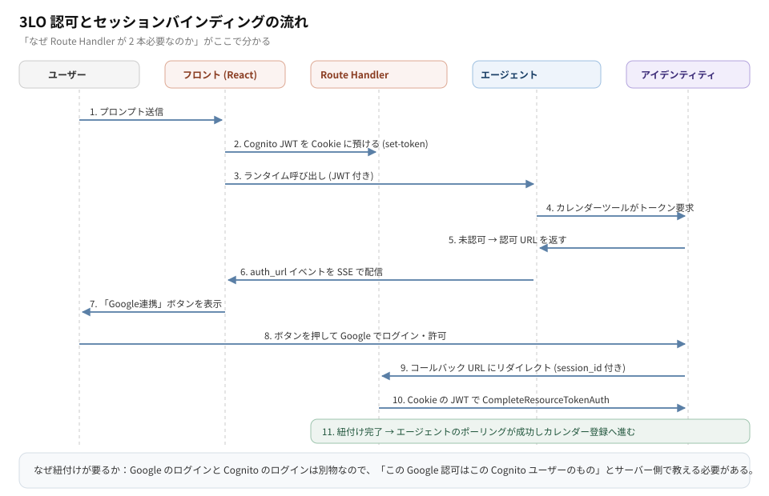

# AgentCore 本 13章ハンズオン 手順ガイド

書籍『Amazon Bedrock AgentCore 実践入門』第13章を、迷わず進めるために組み直した作業手順です。
本の代わりではなく、本を開きながら「今どこにいるか」を確認するための地図として使ってください。
コード本文と詳しい解説は書籍と公式リポジトリを参照します。

- 公式サンプル: <https://github.com/minorun365/agentcore-book/tree/main/chapter13>
- 手元の書籍写真: 各自の手元に用意してください（このリポジトリには含めていません）
- コマンド一覧: [README.md](README.md)（このリポジトリの `bun run` スクリプト）
- メモ用テンプレート: [handson-memo.txt](handson-memo.txt)

---

## 0. まず全体像



作るものは「新刊チェッカー」です。技術書の新刊ページをエージェントがブラウザで見て、
気になる本を選び、ユーザーの Google カレンダーに発売日を登録します。



作業時間の目安は 3〜4 時間です。分割するなら Phase 3 の後（バックエンドが動く状態）か、
Phase 5 の後（Web アプリが表示される状態）で区切ると再開しやすいです。

### 前提チェック

始める前に、これが全部そろっていることを確認してください。

- [ ] AWS アカウント（付録1）とバージニア北部リージョン `us-east-1` での作業
- [ ] Bedrock で Amazon Nova Pro が利用可能
- [ ] GitHub Codespaces の環境構築が済んでいる（付録2）
- [ ] Codespace で `uv --version` と `aws sts get-caller-identity` が通る
- [ ] Google アカウント（カレンダー登録先）
- [ ] 13.1〜13.2 が済んでいる（Google Cloud の OAuth クライアント作成と、AgentCore アイデンティティのクレデンシャルプロバイダー登録）

> Phase 1 は本書 13.1〜13.2 の内容です。このガイドは 13.3 以降を中心に扱います。

### メモ帳を先に開く

このハンズオンの失敗の大半は「値の貼り間違い」です。先にメモ帳を用意してください。



| #   | 値                           | 生まれる場所                | 使う場所                | 自分の値 |
| --- | ---------------------------- | --------------------------- | ----------------------- | -------- |
| 1   | クレデンシャルプロバイダー名 | Phase 1 (13.2.1)            | ランタイム環境変数      |          |
| 2   | ランタイム ARN               | Phase 3 → 13.4.5 でコピー   | Amplify 環境変数 / CLI  |          |
| 3   | ランタイム ID                | ARN の `runtime/` 以降      | ワークロードID 更新 CLI |          |
| 4   | Amplify ドメイン URL         | Phase 5 (13.4.6)            | コールバック URL の材料 |          |
| 5   | コールバック URL             | #4 + `/api/oauth2/callback` | **2か所**に設定         |          |
| 6   | Cognito ユーザープール ID    | Phase 5 (13.4.6)            | 検出 URL に埋め込む     |          |
| 7   | Cognito クライアント ID      | Phase 5 (13.4.6)            | 許可されたクライアント  |          |

センシティブな値なので、GitHub には絶対にプッシュしないでください。

---

## Phase 2　エージェントのプロジェクト作成（13.3.1）

### 2-1. リポジトリを作る

Amplify 公式の Next.js テンプレートから、自分の GitHub リポジトリを作ります。
リポジトリ名は `bookchecker`、可視性は **Private** にします。
他の章で使ってきた共通リポジトリとは別物なので注意してください。

作成できたら `Code` → `Codespaces` → `Create codespace on main` でコードスペースを起動します。
起動直後は初期設定が裏で走っています。「Finished configuring codespace」と出るまで待ってから作業を始めてください。

### 2-2. CLI を用意する

```bash
# リポジトリルートで、AgentCore CLI を含む依存関係を導入
bun install
bunx agentcore --version
```

このモノレポは `package.json` に AgentCore CLI のバージョンを固定しているため、
グローバルインストールは不要です。`agent/` もデプロイ対象なので Git 追跡から
除外しません。AWS CLI の導入だけは [AWS_SETUP.md](AWS_SETUP.md) の手順で行います。

### 2-3. プロジェクトを作る

```bash
bunx agentcore create
```

対話形式の TUI で聞かれます。以下のとおり答えます。

| 設問                          | 答え                         |
| ----------------------------- | ---------------------------- |
| Project name                  | `agent`                      |
| What would you like to build? | Agent                        |
| Agent name                    | `BookChecker`                |
| Select agent type             | Create new agent             |
| Language                      | Python                       |
| Build                         | **Container**                |
| Protocol                      | HTTP                         |
| Framework                     | Strands Agents SDK           |
| Model                         | Amazon Bedrock               |
| Memory                        | **Long-term and short-term** |
| Customize advanced settings   | 何もチェックせず Enter       |

太字の 2 つには理由があります。

- **Container**: ブラウザツールが内部で使う Playwright には実行権限が必要です。直接コードデプロイだと ZIP 展開時に権限が失われます。
- **Long-term and short-term**: この選択によって、後の `agentcore deploy` 時に AgentCore メモリーが自動作成され、メモリー ID がランタイムの環境変数へ自動で注入されます。

**チェックポイント**: `agent/` ディレクトリができ、`agent/app/BookChecker/main.py` と `agent/agentcore/agentcore.json` が生成されていること。

---

## Phase 2b　エージェントのコード実装（13.3.2〜13.3.4）

### 2b-1. 依存パッケージ

```bash
cd agent/app/BookChecker
uv add requests==2.33.1 strands-agents-tools==0.5.1 playwright==1.58.0 nest-asyncio==1.6.0
```

| パッケージ           | 役割                                               |
| -------------------- | -------------------------------------------------- |
| requests             | Google Calendar API への HTTP 送信                 |
| strands-agents-tools | AgentCore ビルトインのブラウザツールを含むツール集 |
| playwright           | ブラウザ操作エンジン（ブラウザツールが内部利用）   |
| nest-asyncio         | 非同期処理（ブラウザツールが内部利用）             |

### 2b-2. カレンダー登録ツール

```bash
touch calendar_tool.py
```

コードは書籍 13.3.3、またはこのリポジトリの
`agent/app/BookChecker/calendar_tool.py` からコピーします。

このファイルは「なぜこう書くのか」が一番おもしろい部分なので、図で押さえておきます。



読むときの着眼点は 3 つです。

1. ツールを直接定義せず `make_calendar_tool(event_queue)` という**関数で生成**している。キューを閉じ込めるため。
2. ツール関数が `async def` になっている。認可待ちの間もストリーミングを止めないため。
3. `@requires_access_token` が `@tool` の**内側**にある。外側だとトークン引数が LLM に見えてしまうため。

### 2b-3. エージェント本体

`main.py` の中身を全部消して、書籍 13.3.4 のコードに置き換えます。
リポジトリでは `agent/app/BookChecker/main.py` です。

構成は次のとおりです。

- 前半: システムプロンプト、`BedrockAgentCoreApp` の作成、エージェント初期化
- 後半: SSE ストリーミング処理（キューから取り出してフロントへ配信）

システムプロンプトには、SB クリエイティブの新刊カレンダーを見る手順と、
終日予定として登録するルールが書かれています。ここを書き換えると挙動を変えられます。

**チェックポイント**: `BookChecker/` の中に `main.py` と `calendar_tool.py` があり、`pyproject.toml` に 4 パッケージが追加されていること。

---

## Phase 3　バックエンドのデプロイ（13.3.5）

```bash
cd /workspaces/bookchecker
bun run agent:validate
bun run agent:deploy
```

- 「CDK bootstrapping required」と出たら Enter を押します（この AWS アカウントで CDK 初回利用のため）
- 「Deploy to AWS Complete」で完了です。7〜8 分かかります

裏で起きていること: Python コードから Docker イメージがビルドされ、ECR のプライベートリポジトリを経由して
AgentCore ランタイムにデプロイされます。同時に AgentCore メモリーも作られます。

**チェックポイント**: マネジメントコンソールの Amazon Bedrock AgentCore →「ランタイム」に `agent_BookChecker` が見えること。

ここでいったん休憩してもよい区切りです。

---

## Phase 4　Web アプリの実装（13.4.1〜13.4.4）

### 4-1. テンプレートの整理

```bash
cd /workspaces/bookchecker

# サンプルの DB 連携は使わないので削除
rm -rf amplify/data

# ルート package.json と bun.lock に固定された依存関係を導入
bun install --frozen-lockfile
```

その前に `amplify/backend.ts` を編集して、`data` に関する 2 行を消し `auth` だけ残します。

依存関係の監査で警告が出ることがあります。書籍によれば、これは Amplify Gen2 の開発補助ツールが内部で使うパッケージ由来で、
デプロイされる Web アプリには含まれません。ただし出版後に状況は変わるので、内容は自分で確認してください。

### 4-2. フロントエンドの 4 ファイル

| ファイル            | 作業     | 役割                           |
| ------------------- | -------- | ------------------------------ |
| `app/providers.tsx` | 新規作成 | Amplify 初期化と認証の共通設定 |
| `app/layout.tsx`    | 書き換え | 全ページ共通レイアウト         |
| `app/page.tsx`      | 書き換え | チャット画面のメイン UI        |
| `app/globals.css`   | 書き換え | 見た目                         |

```bash
touch app/providers.tsx
```

`page.tsx` と `globals.css` は長いので、リポジトリからコピー&ペーストします。

- <https://github.com/minorun365/agentcore-book/blob/main/chapter13/bookchecker/app/page.tsx>
- <https://github.com/minorun365/agentcore-book/blob/main/chapter13/bookchecker/app/globals.css>

このリポジトリの `app/page.tsx` と `app/globals.css` は書籍版ではなく強化版なので、
まず書籍どおりに進めてから [HANDOFF.md](HANDOFF.md) の差分を当ててください。

`amplify_outputs.json` が無いという構文エラーがエディタに出ますが、これは Amplify へのデプロイ時に自動生成されるファイルなので、そのまま進めて問題ありません。

### 4-3. Route Handler を 2 本作る

```bash
mkdir -p app/api/set-token
touch app/api/set-token/route.ts

mkdir -p app/api/oauth2/callback
touch app/api/oauth2/callback/route.ts
```

この 2 本が何のためにあるのかを、先に図で押さえてください。



- `set-token`: Cognito のアクセストークンを HttpOnly Cookie に預ける
- `oauth2/callback`: Google 認可の後に戻ってくる先。Cookie のトークンを使って `CompleteResourceTokenAuth` を呼び、「この Google 認可はこの Cognito ユーザーのもの」と紐付ける（セッションバインディング）

コードは書籍 13.4.4、またはリポジトリの `app/api/` 配下からコピーします。

**チェックポイント**: `app/api/set-token/route.ts` と `app/api/oauth2/callback/route.ts` が存在すること。

---

## Phase 5　Amplify へデプロイ（13.4.5〜13.4.6）

### 5-1. ランタイム ARN を控える（メモ #2, #3）

マネジメントコンソールで Amazon Bedrock AgentCore を開き、**バージニア北部リージョン**にいることを確認します。
「ランタイム」→ `agent_BookChecker` → 画面上部の「ランタイム ARN」をコピーしてメモ #2 へ。

ARN の `runtime/` 以降の部分（例: `agent_BookChecker-XXXXXXXXXX`）がメモ #3 のランタイム ID です。

### 5-2. ブラウザツール用の IAM 権限を足す

`agentcore deploy` はモデル呼び出しやログ書き込み、メモリーやアイデンティティ関連の権限を実行ロールに自動付与します。
ただし**ブラウザツールの権限だけは自動で付きません**。手動で追加します。

1. ランタイム詳細画面で「バージョン1」をクリック
2. 「許可」セクションの IAM サービスロールのリンクを開く
3. IAM コンソールで「許可を追加」→「ポリシーをアタッチ」
4. 「その他の許可ポリシー」から `bedrock` で検索し、以下 2 つにチェックして追加

- `AmazonBedrockFullAccess`
- `BedrockAgentCoreFullAccess`

### 5-3. GitHub へプッシュ

```bash
cd /workspaces/bookchecker
git add -A
git commit -m "最初のコミット"
git push
```

### 5-4. Amplify でデプロイ

AWS Amplify を開き、バージニア北部にいることを確認して「アプリケーションをデプロイ」。

1. 「GitHub」を選択して次へ
2. GitHub の認可を「承認」
3. Amplify GitHub App のインストール画面で自分のアカウントを選択
4. 「Only select repositories」で `bookchecker` を追加して Install & Authorize
5. Amplify に戻って `bookchecker` リポジトリと `main` ブランチを選択して次へ
6. 「詳細設定」を開いて環境変数を追加（下表）
7. 「保存してデプロイ」

| キー                    | 値                       |
| ----------------------- | ------------------------ |
| `NEXT_PUBLIC_AGENT_ARN` | メモ #2 のランタイム ARN |

Next.js プロジェクトが検出され、SSR モードでビルドが始まります。`main` ブランチが「デプロイ済み」になるまで 6〜7 分待ちます。

### 5-5. 値を 3 つ控える（メモ #4, #6, #7）

- **ドメイン URL**（メモ #4）: Amplify コンソールに表示される `https://main.xxxxxxxxxx.amplifyapp.com`
- `main` ブランチ →「デプロイされたバックエンドのリソース」タブ → `AWS::Cognito::UserPool` のリンクから Cognito コンソールへ
- **ユーザープール ID**（メモ #6）: 「ユーザープール情報」セクション
- **クライアント ID**（メモ #7）: 左メニュー「アプリケーションクライアント」

ここで**コールバック URL**（メモ #5）も作っておきます。ドメイン URL の末尾にパスを足すだけです。

```
https://main.xxxxxxxxxx.amplifyapp.com/api/oauth2/callback
```

**チェックポイント**: ドメイン URL にアクセスすると Cognito のサインアップ画面が出ること。まだチャットは動きません。

---

## Phase 6　結線（13.4.7〜13.4.8）★ 最難関

ここが一番ミスが起きます。作業は 4 ブロックあります。

### 6-1. SSR コンピュートロールを作る（13.4.7）

Route Handler は `CompleteResourceTokenAuth` を呼ぶので、Amplify のサーバー側に IAM 権限が要ります。

IAM コンソール →「ロール」→「ロールを作成」

1. 「信頼されたエンティティタイプ」で「カスタム信頼ポリシー」を選び、JSON を以下に置き換え

```json
{
  "Version": "2012-10-17",
  "Statement": [
    {
      "Effect": "Allow",
      "Principal": {
        "Service": "amplify.amazonaws.com"
      },
      "Action": "sts:AssumeRole"
    }
  ]
}
```

2. `BedrockAgentCoreFullAccess` ポリシーを検索してチェック
3. ロール名を `bookchecker-ssr-role` にして作成

作ったら Amplify に設定します。Amplify コンソールで `bookchecker` を開き、
「アプリケーションの設定」→「IAM ロール」→「コンピューティングロール」の編集 →
「デフォルトのロール」で `bookchecker-ssr-role` を選んで保存。

### 6-2. ランタイムの環境変数と JWT 認証（13.4.8）

AgentCore コンソール →「ランタイム」→ `agent_BookChecker` →「ホスティングをアップデート」。

「高度な設定」を開き、環境変数を 3 つ追加します（既存の変数は消さない）。

| 変数名                     | 値                                     |
| -------------------------- | -------------------------------------- |
| `CALLBACK_URL`             | メモ #5 のコールバック URL             |
| `CREDENTIAL_PROVIDER_NAME` | メモ #1 のクレデンシャルプロバイダー名 |
| `AWS_DEFAULT_REGION`       | `us-east-1`                            |

続いて「インバウンド認証」セクションで「JSON Web Tokens (JWT) を使用」を選び、以下を設定します。

| 項目                   | 値                                                                                      |
| ---------------------- | --------------------------------------------------------------------------------------- |
| 検出 URL               | `https://cognito-idp.us-east-1.amazonaws.com/<メモ#6>/.well-known/openid-configuration` |
| 許可されたクライアント | メモ #7 のクライアント ID（「クライアントを追加」ボタンから）                           |

これで Cognito でログインしたユーザーだけがエージェントを呼べます。
設定できたら右下の「ホストエージェント/ツール」で再デプロイします。

### 6-3. ワークロード ID に許可 URL を登録（13.4.8）

コールバック URL は**もう 1 か所**、AgentCore アイデンティティのワークロード ID にも登録が必要です。
これはコンソールから設定できないので CLI で行います。

マネジメントコンソール右上の CloudShell アイコンからターミナルを開き、実行します。

```bash
aws bedrock-agentcore-control update-workload-identity \
  --name <メモ#3 のランタイムID> \
  --allowed-resource-oauth2-return-urls <メモ#5 のコールバックURL>
```

`<>` は書きません。値だけを入れます。

### 6-4. Google Cloud 側のリダイレクト URI

Phase 1 で作った Google Cloud の OAuth クライアントにも、AgentCore のコールバック先が登録されている必要があります。
書籍 13.2 の手順どおりに設定済みか確認してください。

**チェックポイント（結線の最終確認）**

- [ ] コールバック URL が「ランタイム環境変数」と「ワークロード ID」で**完全に同じ文字列**
- [ ] 検出 URL のユーザープール ID がメモ #6 と一致
- [ ] 許可されたクライアントがメモ #7 と一致
- [ ] Amplify のコンピューティングロールが設定済み

---

## Phase 7　動作確認（13.5.1）

Amplify のドメイン URL にアクセスします。

1. Cognito のサインアップ画面でメールアドレスとパスワードを入力してアカウント作成
2. 届いた確認コードを入力してログイン
3. チャットで依頼する。例:「私は AI に興味があります。来月の技術書の新刊をチェックして、面白そうなものを1つ選んでカレンダーに入れて」

期待される動き。

| #   | 起きること                                                       |
| --- | ---------------------------------------------------------------- |
| 1   | ブラウザツールで新刊カレンダーにアクセスし、PC/IT 書籍でフィルタ |
| 2   | 技術書をピックアップして、登録してよいか確認してくる             |
| 3   | 「はい」と答えると Google 連携ボタンが表示される                 |
| 4   | ボタンから Google 認可へ。「確認されていません」警告は「続行」   |
| 5   | 連携完了のページが出たらタブを閉じてチャットに戻る               |
| 6   | エージェントが自動でカレンダー登録を続行し、完了メッセージが出る |
| 7   | Google カレンダーに実際に予定が入っている                        |

### メモリーの動作も試す

- **短期記憶**: リロードせずに続けて「他におすすめの本は?」と送ると、直前に提示した書籍を覚えた状態で答える
- **長期記憶**: リロードしてから「私の好みに基づいて、新しい書籍をおすすめして」と送る。セッションは切り替わるが、同じ Cognito ユーザーなら過去の好みを踏まえた応答が返る

一度 Google 連携が完了するとトークンがキャッシュされるため、しばらくは連携ボタンが出ずに直接登録が走ります。

---

## Phase 7b　オブザーバビリティ（13.5.3）

AgentCore CLI でデプロイしたアプリは、自動で CloudWatch にトレースを連携します。

**トレースを見る**
AgentCore コンソール →「ランタイム」→ `agent_BookChecker` → 「DEFAULT」エンドポイントの「ダッシュボード」リンク
→ CloudWatch の生成 AI オブザーバビリティ画面 →「トレース」タブ

任意のトレースを開くとスパンの階層が出て、各ステップの処理時間とトークン数が見えます。
どこが遅いか、どのツールで止まったかが分かるので、ボトルネック特定とデバッグに使えます。

**ログを見る**
トレースはエージェントが正常起動した場合に記録されます。アプリ自体の起動に失敗したときはトレースが残りません。
その場合はランタイム詳細画面 →「DEFAULT」エンドポイントの「ログ」リンク → CloudWatch Logs へ。
コンテナ起動ごとにログストリームが分かれるので、「すべてのログストリームを検索」で一括検索すると早いです。

---

## Phase 8　クリーンアップ（13.5.4）★ 忘れずに

すべてサーバーレスなので置いておいても大きな課金は発生しません。
ただし**このアプリは URL を知っていれば誰でも利用登録できます**。公開したままだと意図しない課金やセキュリティリスクになります。終わったら消してください。

1. **AgentCore 関連**（AgentCore コンソールの左サイドバーから）
   - ランタイム: `agent_BookChecker`
   - メモリー: デプロイ時に自動作成されたもの
   - アイデンティティ: 13.2.1 で作ったクレデンシャルプロバイダー
2. **Amplify アプリ**: アプリケーションの設定 → 全般設定 → 画面下部の「アプリの削除」
3. **ECR リポジトリ**: `agent/bookchecker` リポジトリ
4. **Google Cloud プロジェクト**: 不要なら IAM と管理 → 設定 からシャットダウン

これらを消しても、13.4.7 で作った IAM ロールや、`agentcore deploy` が自動作成した IAM ロール・
CloudWatch Logs のロググループ・CodeBuild プロジェクトは残ります。放置しても課金は発生しませんが、
気になる場合は各サービスのコンソールから手動で削除してください。

---

## トラブルシューティング

### まず疑うこと

手順の抜けか、入力値の誤字です。前から順に見直すのが結局いちばん速いです。

| 症状                             | 確認する場所                                                                                                                                 |
| -------------------------------- | -------------------------------------------------------------------------------------------------------------------------------------------- |
| 「考え中…」のまま応答が来ない    | Amplify (Phase 5) と ランタイム (6-2) の両方で環境変数が正しいか。JWT 認証のユーザープール ID・クライアント ID がメモ #6 #7 と一致しているか |
| エージェントがブラウザを使えない | ランタイムの実行ロール (5-2) に `AmazonBedrockFullAccess` と `BedrockAgentCoreFullAccess` が付いているか                                     |
| Google 連携に失敗する            | コールバック URL (メモ #5) が、ランタイム環境変数とワークロード ID の**2か所**に同じ値で入っているか                                         |
| ビルドが失敗する                 | Amplify コンソールで `main` ブランチのカードを開き、「ビルド」「デプロイ」セクションのログを確認                                             |

### ★ 再デプロイ時の落とし穴

バックエンドのコードを直して `agentcore deploy` をやり直すと、
**コンソールから手で設定したランタイムの環境変数とインバウンド認証の設定がリセットされます**。
つまり Phase 6-2 をもう一度やる必要があります。これを知らないと「さっきまで動いていたのに」となります。

フロントエンドの修正は GitHub にプッシュするだけで Amplify が自動的に再デプロイします。

### AI に手伝ってもらう

エラーの原因が分からないときは、該当のコードと画面のエラーメッセージ、
必要ならスクリーンショットを添えて AI に聞くのが速いです。機密情報を送らないよう注意してください。

Codespaces なら右サイドバーの GitHub Copilot Chat が使えます。設定画面から Web 検索機能を有効にしておくと、
最新情報を参照した回答が得られます。Claude Code などの CLI ベースのエージェントをコードスペースに入れる方法もあります。

AgentCore や Strands Agents はアップデートが速い分野なので、AI に質問するときは公式ドキュメントの URL を渡すか、
公式 MCP サーバーを設定して最新情報を自動参照させるのが有効です。

ツールが想定どおり動かないときは、チャット画面からエージェント自身に「今どこでエラーが起きていますか?」と聞くのも効きます。
エラー内容を詳しく教えてくれることがあります。

---

## この後の発展

- 第15章では AWS CDK で AgentCore ランタイムと周辺リソースをまとめてデプロイします。今回の GUI 操作をコード化する回です。
- フロントエンドを強化する差分（マルチセッション永続化・SSE 堅牢化・レートリミット）はこのリポジトリそのものです。内容は [HANDOFF.md](HANDOFF.md) にまとめてあります。本ハンズオンを一度完走してから適用してください。
- ローカルだけで動かす手順（Cognito なし・DynamoDB Local・エージェントをローカル起動）は [LOCAL_DEV.md](LOCAL_DEV.md) を参照してください。
